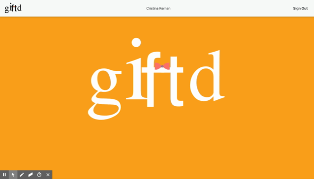

# giftd

### An application to make your wish a reality

## Purpose

Need a place for your friends to see your gift wishes at all times of the year? giftd does the work for you!

## Wanna check it out for yourself? Click [here!!](https://giftd-app.herokuapp.com)

## MVP

* Web Based application for people to create profiles
* Pages secured with Auth0 so you cannot view other user's information unless logged in and connected with them
* Each user will create various gift wish lists for different events
* Users will buy gifts from each other's lists
* Once your friend finds something to buy you, then can reserve it by clicking the "buy me!" button. This will change the status of the item to "purchased" and will update its status in the databse
* Wish list items can be shared between event lists

## Contributors

* Thomas Smajstrla - Database configuration and seeds / search for friend component
* Cristina Kernan - user profile component / add item & and list components / Material UI
* Meg Gallagher - Auth0 / friend profile components 
* Kathleen Doviken - welcome page and logo

### Techonology Used

* React
* Javascript
* MySQL
* Sequelize
* Heroku
* Auth0
* Material UI
* Bootstrap
